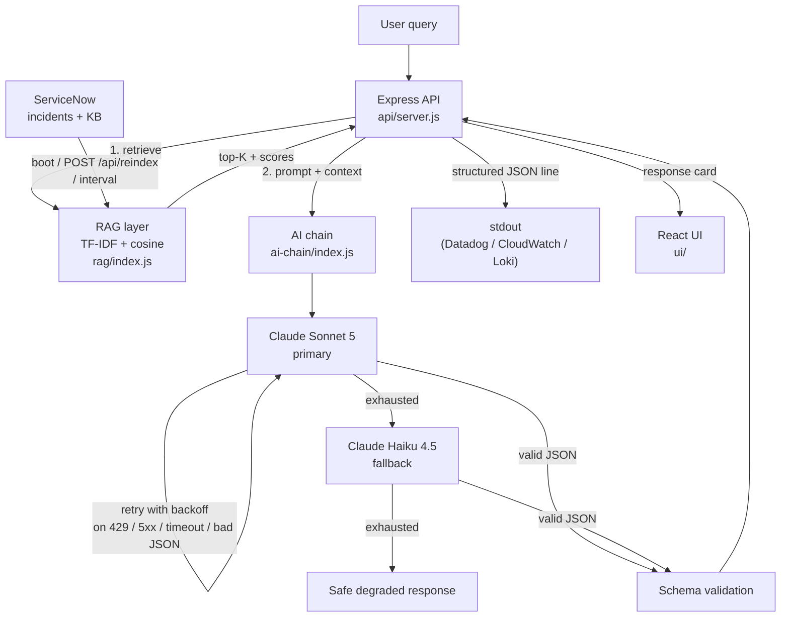

# SN Triage Copilot

AI-powered IT triage assistant built on Claude + ServiceNow. A proof of concept for the patterns behind a real triage tool: lexical RAG over past incidents, primary/fallback model routing with retries, enforced structured output, and observability from day one.

Built by [Automatiki](https://automatiki.com) as a portfolio piece.

---

## What it demonstrates

| Concept | Where to look |
|---|---|
| Lexical RAG (TF-IDF + cosine) | `rag/index.js` |
| Retry-before-failover model chain | `ai-chain/index.js` |
| Schema-validated JSON output | `ai-chain/index.js` — `validateSchema` |
| Structured JSON logs to stdout | `observability/index.js` |
| Corpus refresh (endpoint + interval) | `api/server.js` — `reindex()` |
| Bearer auth, rate limit, body cap | `api/server.js` |
| ServiceNow REST integration | `sn-client/index.js` |
| Offline retrieval eval harness | `evals/` |

---

## Architecture



Module boundaries are deliberate: the RAG layer doesn't know Claude exists, the AI chain doesn't know ServiceNow exists, and only the API server (`api/server.js`) touches everything.

---

## Project structure

```
sn-triage-copilot/
├── rag/              TF-IDF retrieval + cosine similarity
├── ai-chain/         Claude calls, retry, failover, schema validation
├── observability/    JSON-lines logger + capped ring buffer
├── sn-client/        ServiceNow REST wrapper (incidents, KB, work notes)
├── api/              Express server — orchestration
├── ui/               React + Vite chat interface
└── evals/            Offline retrieval eval harness (hit@k, MRR)
```

---

## User guide

### Prerequisites

- Node.js 18+ (tested on 22)
- An Anthropic API key — [console.anthropic.com](https://console.anthropic.com)
- A ServiceNow instance you can hit with basic auth (a free developer instance works)

### 1. Install

```bash
git clone https://github.com/Zijadx/sn-triage-copilot.git
cd sn-triage-copilot
npm run install:all
```

This installs the root, `api/`, and `ui/` packages.

### 2. Configure

Create `.env` at the repo root:

```bash
# Claude
ANTHROPIC_API_KEY=sk-ant-...
PRIMARY_MODEL=claude-sonnet-5              # optional, default shown
FALLBACK_MODEL=claude-haiku-4-5-20251001   # optional
REQUEST_TIMEOUT_MS=15000                   # optional
MAX_RETRIES=2                              # per model, before failover

# ServiceNow
SN_INSTANCE_URL=https://devXXXXX.service-now.com
SN_USERNAME=admin
SN_PASSWORD=...

# API server
API_TOKEN=                                 # required for auth; leave blank in dev only
NODE_ENV=development                       # 'production' will refuse to start without API_TOKEN
PORT=3001
CORS_ORIGIN=http://localhost:5173

# Corpus refresh (optional)
REINDEX_INTERVAL_MS=0                      # 0 = disabled; e.g. 21600000 = every 6h

# Rate limit + logs (optional)
TRIAGE_RATE_LIMIT=20                       # requests per minute per IP
LOG_BUFFER_SIZE=500                        # for the /api/logs dashboard
RAG_TOP_K=5
RAG_SIMILARITY_THRESHOLD=0.05
```

Only `ANTHROPIC_API_KEY` and the three `SN_*` values are strictly required.

### 3. Run

```bash
npm start
```

- API: `http://localhost:3001`
- UI:  `http://localhost:5173`

Boot logs will show ServiceNow connection status and the number of documents indexed:

```
[Boot] Connecting to ServiceNow...
[Reindex] Starting (trigger=boot)
[RAG] Seeding corpus with 342 documents...
[RAG] Corpus ready. 342 documents, 4127 unique terms.
[Reindex] OK: 342 documents in 1284ms
[Server] Running on http://localhost:3001
```

### 4. Verify

```bash
# Health (open, no auth)
curl http://localhost:3001/api/health

# Triage (auth required if API_TOKEN is set)
curl -X POST http://localhost:3001/api/triage \
  -H "Content-Type: application/json" \
  -H "Authorization: Bearer $API_TOKEN" \
  -d '{"query":"VPN error 691 on Windows, works on other machines"}'

# Force a corpus refresh
curl -X POST http://localhost:3001/api/reindex \
  -H "Authorization: Bearer $API_TOKEN"

# Recent request log + stats (dashboard payload)
curl -H "Authorization: Bearer $API_TOKEN" http://localhost:3001/api/logs
```

### 5. Run the retrieval eval

The eval runs against fixture data — no API keys needed, no ServiceNow needed.

```bash
npm run eval
```

Prints a per-query table plus a summary (hit@1, hit@3, hit@5, MRR) and exits non-zero if `hit@5` drops below `MIN_HIT_AT_5` (default `0.8`). Wire it into CI to catch retrieval regressions.

Current baseline on the fixture corpus: **hit@1 86.7%, hit@3 93.3%, MRR 0.900**.

### 6. Trigger a failover (optional demo)

```bash
PRIMARY_MODEL=invalid-model-name npm start
```

Send any query — the meta bar will show `⚠ fallback triggered` and `claude-haiku-4-5-...` as the model that answered.

---

## Endpoints

| Method | Path | Auth | Purpose |
|---|---|---|---|
| POST | `/api/triage` | Bearer | Run one triage request. Rate-limited. |
| POST | `/api/reindex` | Bearer | Re-fetch from SN and rebuild the RAG corpus. |
| GET  | `/api/logs` | Bearer | Recent requests + stats (dashboard). |
| GET  | `/api/health` | none | Component health for load balancers. |

---

## Deployment notes (sub-prod)

- **`NODE_ENV=production` requires `API_TOKEN`.** The server refuses to start without one in that mode.
- **Structured JSON logs go to stdout** — point your platform (Datadog, CloudWatch, Loki) at the container's stdout stream. The in-memory buffer behind `/api/logs` is dashboard-only and per-replica.
- **Bearer auth + per-IP rate limit + 10 KB body cap** are on by default. Rate limit uses `X-Forwarded-For` (see `trust proxy`) so it works behind a reverse proxy.
- **Corpus refresh:** set `REINDEX_INTERVAL_MS` (e.g. `21600000` for 6 h), or wire an external scheduler to `POST /api/reindex`.
- **Failed reindex is safe** — the previous corpus stays in place.
- The `Dockerfile` in the repo builds a runnable image; supply the env above at container start.

---

## Design decisions

**Why lexical (TF-IDF) instead of vector embeddings?**
Zero external dependencies for the POC. The `rag/` interface (`seedCorpus`, `retrieve`, `formatContext`) stays the same when you swap in OpenAI / Voyage / Cohere embeddings — only the internals change. TF-IDF hits ~87% top-1 on the fixture set; the misses are exactly the paraphrase cases embeddings are designed to solve.

**Why retry the same model before failing over?**
Most Sonnet failures are transient (429s during a burst, a slow response tripping the timeout). Retrying with backoff resolves those without demoting to a smaller model. Failover is only for real outages.

**Why enforce JSON schema, not just parse?**
`JSON.parse` catches malformed text. It doesn't catch a valid-JSON object with `confidence: "very high"` or `sources` as a string. Schema validation is what actually makes the UI safe to render without a runtime check on every field.

**Why calibrated confidence in the system prompt?**
An AI tool that admits uncertainty beats one that sounds equally sure of everything. The rules for "high" vs "low" are explicit in the system prompt — no confidence, no shipping the answer as authoritative.

**Why separate modules?**
Each concept should be explainable in isolation. If a reader can't understand the RAG layer without also understanding Claude, the boundary is wrong. Only `api/server.js` imports from everywhere — and that's the deliberate seam.

---

## Limitations (be honest with yourself)

This is a proof of concept. It's built to demonstrate the patterns, not to point at a live ticket queue.

- **Lexical retrieval has a ceiling.** TF-IDF ranks by shared vocabulary — it will miss "spitting out random symbols" ≈ "garbled output" and prefer surface overlap ("Windows" pulling a VPN case above a disk-full case). Production wants real semantic embeddings.
- **In-memory dashboard buffer.** The `/api/logs` payload is for a live demo, not durable storage. Restart wipes it; horizontal replicas each keep their own. Ship stdout to a real backend.
- **Corpus size is bounded by memory.** The current design holds every doc's TF-IDF vector in the process. Fine for thousands of incidents; not fine for millions. That's what a vector DB is for.
- **No LLM-side evals yet.** The `evals/` harness covers retrieval — the "did we find the right past incident" question. It doesn't yet measure confidence calibration or grounding of the generated answer. Both belong in a separate harness that hits the API.
- **Single-tenant auth.** One shared bearer token. Real deployments want OIDC / mTLS / per-user tokens.
- **No corpus write-back by default.** `sn-client` has `addWorkNote`, but the API doesn't wire it. A write path needs approvals and audit that are out of scope for a POC.

---

## Roadmap

- Swap TF-IDF for a real embedding provider (Voyage or OpenAI) behind the same `rag/` interface; compare hit@k and MRR against the current baseline.
- LLM-side eval harness: confidence calibration curve, source-grounding check, answer quality rubric.
- Streaming responses in the UI once the schema is confirmed.
- SSO / per-user tokens instead of the shared bearer.
- Optional MCP wrapper around `sn-client` so the same ServiceNow integration is reusable from Claude Desktop / Claude Code.

---

## License

MIT
